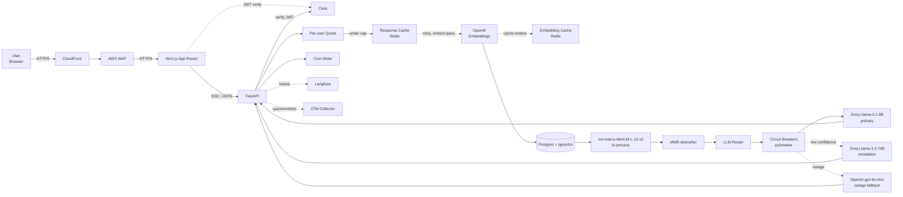
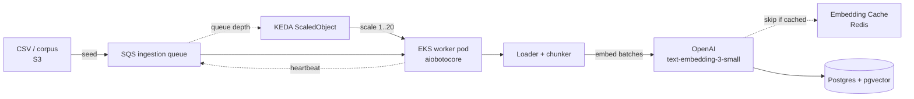
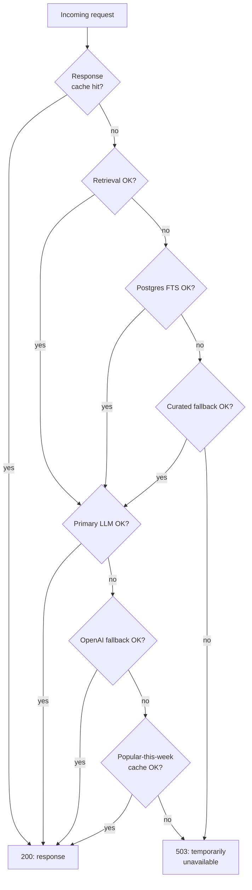
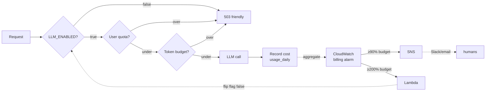
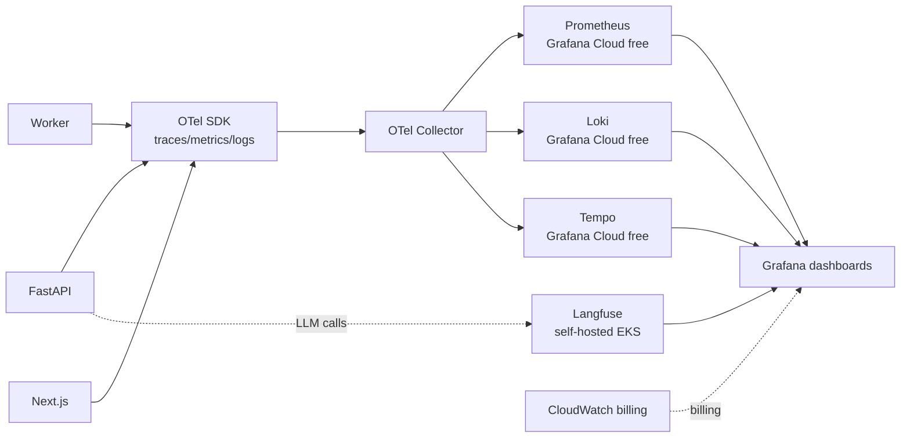

# Architecture

A walkthrough of how the pieces fit together at run time: the request path, the
ingestion path, and how the system behaves when a dependency fails.

> Scope note: the non-functional targets are validated with synthetic load on a
> single-replica local stack. That demonstrates the architecture and patterns;
> operating at real production scale (real traffic, on-call, multi-region) is a
> separate step not covered by this repo.

---

## 1. System diagram (query path)

### Walk-through (one query end-to-end)

1. **Browser → CloudFront → WAF → Next.js:**
 TLS terminates at CloudFront; AWS WAF rate-limits + blocks abuse before
 anything else; Next.js serves the App Router shell.
2. **Next.js → Clerk → Next.js:** the session is verified at the Server
 Component layer; unauthenticated requests redirect to sign-in.
3. **Next.js → FastAPI:** the recommend request goes to `/v1/recommend`
 (structured) or `/v1/recommend/stream` (SSE token stream).
4. **FastAPI verifies the Clerk JWT:** signed-out requests get 401 before
 anything else; the user-id becomes the tenant scope.
5. **Quota gate:** Redis sliding-window + Postgres durable counter; over-cap
 returns 429 with `Retry-After`. The kill-switch feature flag `LLM_ENABLED`
 short-circuits here when global spend exceeds 200% of budget.
6. **Response cache lookup:** sha256(query) keyed; instant hit returns
 without touching the LLM.
7. **Query embedding:** the query is embedded once and the embedding is
 cached, so a re-ask of the same query skips the OpenAI round-trip.
8. **Hybrid retrieval:** dense (pgvector cosine) ∪ sparse (Postgres FTS) →
 reciprocal-rank fusion → top-20 candidates.
9. **Reranker:** ms-marco-MiniLM-L-12-v2 scores (query, candidate) pairs CPU-fast,
 in-process; narrows to top-5.
10. **MMR diversifier:** lambda=0.7; final top-3 with diversity.
11. **LangChain v1 chain:** `create_retrieval_chain` + `create_stuff_documents_chain`
 composes prompt + LLM + Pydantic output parser.
12. **LLM routing:** default = Groq Llama-3.1-8B-instant; escalate to
 Llama-3.3-70B on low-confidence signal; OpenAI gpt-4o-mini on Groq outage.
 Circuit breakers from pybreaker open after N consecutive failures.
13. **Cost meter + history:** per-tenant tokens/cost recorded to
 `usage_daily`; query + result persisted to `query_history`.
14. **Observability:** OTel spans from auto-instrumentations
 (FastAPI/SQLAlchemy/Redis/httpx); Langfuse per-LLM-call traces with prompt,
 response, tokens, cost, latency, prompt version.

---

## 2. System diagram (ingestion path)

KEDA autoscales worker replicas on `ApproximateNumberOfMessages` (target = 10
msgs/worker; min 1, max 20). Idempotency keys make the worker at-least-once
safe — duplicate messages produce the same final state.

---

## 3. Failure-mode flow (the fallback chain)

Each downstream call is wrapped in a pybreaker circuit breaker. After
N consecutive failures the breaker opens and subsequent calls short-circuit
to the next fallback immediately (no further latency penalty).

See `docs/runbooks/provider-outage.md` for the operator-side flow when LLM
providers are degraded.

---

## 4. Multi-tenancy model

- **Each authenticated user is a tenant.** Per-user data isolation via
 `user_id` FK on `query_history`, `feedback`, `usage_daily`, `quota_counters`.
- **ACL-at-retrieval enforcement:** every pgvector query carries a `tenant_id`
 filter. The anime corpus is global content (no per-tenant private data) —
 but the discipline pattern is enforced from day 1 so adding private corpora
 later is a config flip, not a refactor.
- **Cross-tenant leakage test** in `apps/api/tests/test_auth_required.py`
 proves the boundary: User A authenticated, queries User B's history → 403.

Orgs / teams: out of scope for v1.

---

## 5. Cost flow + kill switch

Spend alerts at 50% / 75% / 90% of monthly budget → SNS → email + Slack.
Hard kill switch at 200% → CloudWatch alarm → Lambda → `LLM_ENABLED=false`.
Graceful degradation: users get a friendly "temporarily unavailable" message,
not an error.

---

## 6. Observability flow

- **App-level** observability via OTel SDK → Grafana Cloud free tier
 (Prometheus + Loki + Tempo).
- **LLM-specific** observability via Langfuse self-host on EKS — per-request
 trace with prompt, response, tokens, cost, latency, prompt version.
- **Dashboards** in Grafana correlate app traces (Tempo) with LLM traces
 (Langfuse data source) for a single request via `request_id`.

---

## 7. Runtime knobs (where the tuning playbook turns them)

The `tests/load/scenarios.md` tuning playbook references these env vars and
config locations:

| Knob | Default | Source | Effect |
|---|---|---|---|
| `RESPONSE_CACHE_TTL_SECONDS` | 86400 | `.env` | Longer → hot keys hit cache more |
| `RETRIEVAL_TOP_K` | 20 | `.env` | Smaller → faster pgvector + reranker |
| `RERANK_K` | 5 | `.env` | Smaller → fewer reranker scores |
| `RERANKER_BATCH_SIZE` | 32 | `.env` | Bigger → fewer model calls (if CPU has headroom) |
| `LLM_DEFAULT_MODEL` | `llama-3.1-8b-instant` | `.env` | Swap to escalation if quality bottleneck |
| `LLM_MAX_OUTPUT_TOKENS` | 800 | `.env` | Shorter generations → faster |
| `DB_POOL_SIZE` | 10 | `.env` | Bigger → fewer connection-acquire timeouts |
| `DB_POOL_MAX_OVERFLOW` | 5 | `.env` | Bigger → burst headroom |
| `LLM_ENABLED` | true | feature flag | Global kill switch |
